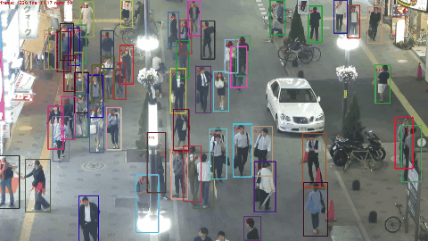
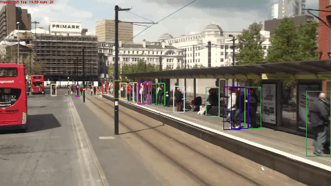

<div align="center">

# 🎯 VisionTrack

### Real-time Multi-Object Tracking with a Live Analytics Dashboard

*YOLOv8 detection → custom ByteTrack-style tracker → Streamlit analytics dashboard*

[](https://github.com/HarshaVardhan3002/Object_tracker/actions/workflows/ci.yml)
[](https://www.python.org/)
[](https://pytorch.org/)
[](https://github.com/ultralytics/ultralytics)
[](https://streamlit.io/)
[](https://www.docker.com/)
[](./LICENSE)




</div>

---

## ✨ What this is

**VisionTrack** is an end-to-end multi-object tracking system that turns a raw video stream into a live operations dashboard. It pairs a modern YOLOv8 detector with a from-scratch ByteTrack-style tracker and layers four analytics views on top — object counts, motion heatmap, trajectory trails, and per-track speed/direction — all streamed into a Streamlit UI you can run locally or ship in a Docker container.

I built it to prove out three things at once:

1. **The math** — a clean, self-contained Kalman filter + Hungarian-assignment tracker, not a black-box library wrapper.
2. **The engineering** — a modular pipeline that is equally usable from a CLI, a Streamlit app, or a FastAPI service, with tests and CI.
3. **The product** — a dashboard a non-technical stakeholder can actually open and drive.

## 🎬 Live demo

```bash
pip install -r requirements.txt
streamlit run app.py
```

Then upload any MP4 in the browser, pick the classes you care about (people, cars, bikes, …) and watch the tracker light up.

> On first run YOLOv8 weights (~6 MB for `yolov8n.pt`) auto-download from Ultralytics.

## 🖥️ Dashboard at a glance

| Panel | What it shows |
| :--- | :--- |
| **Live preview** | Annotated frame with bounding boxes, stable IDs, per-track speed, and fading motion trails |
| **Motion heatmap** | Accumulated density of where objects moved, with a slow temporal decay so the map stays responsive |
| **Metric cards** | Live FPS, unique IDs seen, currently-active tracks, mean & max speed |
| **Class breakdown** | Bar chart + table of unique IDs per class (person, car, bicycle, …) |
| **Controls** | Confidence / IoU thresholds, class filter, tracker hyperparameters, overlay toggles, frame stride |

## 🏗️ Architecture

```
            ┌────────────┐     ┌──────────────────┐     ┌─────────────────┐
  frame ──▶ │ YOLOv8     │ ──▶ │  ByteTracker     │ ──▶ │ Analytics suite │
            │ (detect)   │     │  (Kalman+IoU+HA) │     │ counts/heatmap/ │
            └────────────┘     └──────────────────┘     │ trails/speed    │
                                                         └────────┬────────┘
                                                                  │
                                                                  ▼
                                                         ┌─────────────────┐
                                                         │  Streamlit UI   │
                                                         │  or CLI / API   │
                                                         └─────────────────┘
```

The three stages are intentionally loosely coupled:

- `src/detector/yolo.py` — `YOLODetector` returns a list of `Detection` objects with xyxy, confidence and class.
- `src/tracker/` — a **from-scratch** Kalman filter (`kalman_filter.py`), IoU-based cost matrix (`matching.py`) and the two-stage association logic in `byte_tracker.py`. No `filterpy`, no DeepSORT embeddings; the math is fully visible.
- `src/analytics/` — independent modules for counting, heatmapping, trajectory storage and speed/direction estimation. Each one consumes the same `Track` list, so you can turn any of them off without touching the others.
- `src/pipeline.py` — a single orchestration class (`TrackingPipeline`) used by both the CLI and the dashboard, so there is exactly one place to change behavior.

A longer write-up with the derivations for the Kalman state parameterization and the ByteTrack two-stage trick lives in [`docs/ARCHITECTURE.md`](docs/ARCHITECTURE.md).

## 📂 Project layout

```
Object_tracker/
├── app.py                    # Streamlit dashboard (main demo surface)
├── demo.py                   # CLI runner for files and webcams
├── src/
│   ├── detector/yolo.py      # YOLOv8 wrapper + Detection dataclass
│   ├── tracker/
│   │   ├── kalman_filter.py  # 8-state constant-velocity KF (from scratch)
│   │   ├── matching.py       # IoU cost matrix + Hungarian assignment
│   │   └── byte_tracker.py   # Two-stage class-aware tracker
│   ├── analytics/
│   │   ├── counter.py        # Unique-ID counter + class breakdown
│   │   ├── heatmap.py        # Temporally-decayed motion heatmap
│   │   ├── trajectory.py     # Per-track ring-buffer trails
│   │   └── speed.py          # Windowed speed + direction estimation
│   ├── visualization/draw.py # Box / label / arrow / trail rendering
│   └── pipeline.py           # End-to-end orchestration class
├── tests/                    # pytest suite, numpy-only (no GPU needed)
├── docker/                   # Dockerfile + docker-compose
├── docs/ARCHITECTURE.md      # Design notes and algorithm derivation
├── scripts/                  # Utility scripts (sample video downloader, …)
└── assets/                   # Demo GIFs from MOT16
```

## 🚀 Quick start

### 1. Clone and install

```bash
git clone https://github.com/HarshaVardhan3002/Object_tracker.git
cd Object_tracker
pip install -r requirements.txt
```

### 2. Run the dashboard

```bash
streamlit run app.py
```

Open `http://localhost:8501`, upload a video, and hit **Start tracking**.

### 3. Or use the CLI

```bash
# Grab a small sample video
python scripts/download_sample_video.py

# Track only people and cars, save an annotated MP4
python demo.py --source data/sample.mp4 \
               --output results/sample_tracked.mp4 \
               --classes person car
```

### 4. Or run in Docker

```bash
docker build -t visiontrack -f docker/Dockerfile .
docker run --rm -p 8501:8501 visiontrack
```

## 🧪 Tests

```bash
pip install -r requirements-dev.txt
pytest -q tests/
```

The suite covers the full tracker / analytics stack without requiring YOLOv8 weights, so it runs in under a second and is wired into GitHub Actions CI on every push.

## ⚙️ Configuration cheat-sheet

| Control | Default | Effect |
| :--- | :---: | :--- |
| `conf_threshold` | `0.35` | Drops weak detections before they ever reach the tracker |
| `high_thresh` / `low_thresh` | `0.50` / `0.10` | Split point for ByteTrack's two-stage association |
| `match_thresh` | `0.80` | Max `1-IoU` cost for a track/detection to be matched |
| `max_lost_frames` | `30` | How long we remember an occluded track before retiring it |
| `trail_length` | `60` | Frames of history drawn per trajectory |

## 🔭 Roadmap

- [ ] Line-crossing counters (in/out) with per-class totals
- [ ] Re-ID embeddings (OSNet) for robust long-occlusion recovery
- [ ] TensorRT export for real-time inference on Jetson
- [ ] WebRTC live streaming into the dashboard for remote cameras
- [ ] Hugging Face Space deployment with public demo link

## 🤝 Acknowledgements

- [Ultralytics YOLOv8](https://github.com/ultralytics/ultralytics) for the detector backbone.
- [ByteTrack](https://arxiv.org/abs/2110.06864) for the two-stage association strategy that inspired the tracker.
- The original [MOT16 Challenge](https://motchallenge.net/) dataset for the demo GIFs.

## 📜 License

[MIT](./LICENSE) — do what you want, but please keep the copyright notice.

---

Built with ❤️ by **Sai Harshavardhan** ([@HarshaVardhan3002](https://github.com/HarshaVardhan3002)). If this is useful to you, a ⭐ on the repo means a lot.
